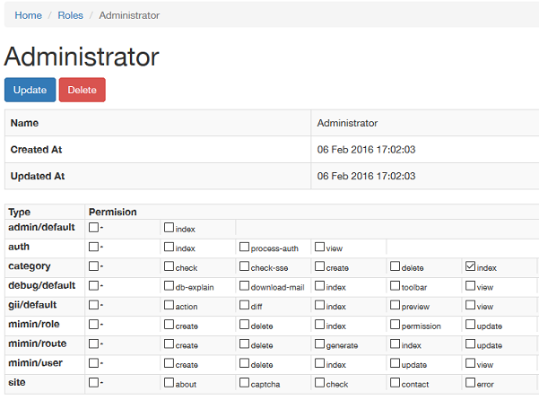

Yii2 Mimin
===============
Simple RBAC Manager fo Yii 2.0. Minify of [yii2-admin](https://github.com/mdmsoft/yii2-admin) extension with awesome features

[](https://packagist.org/packages/hscstudio/yii2-mimin) [](https://packagist.org/packages/hscstudio/yii2-mimin) [](https://packagist.org/packages/hscstudio/yii2-mimin) [](https://packagist.org/packages/hscstudio/yii2-mimin)

Attention
---------
Before you install and use this extension, then make sure that your application has been using the login authentication to the database. especially for yii basic template. Because without it, this extension will produce error and useless.

Installation
------------

The preferred way to install this extension is through [composer](http://getcomposer.org/download/).

Either run

```
php composer.phar require --prefer-dist hscstudio/yii2-mimin "~2.0"
```

or add

```
"hscstudio/yii2-mimin": "~2.0"
```

to the require section of your `composer.json` file.


Configuration
-------------

Once the extension is installed, simply use it in your code by  :

in config
```php
'as access' => [
     'class' => '\hscstudio\mimin\components\AccessControl',
	 'allowActions' => [
		// add wildcard allowed action here!
		'site/*',
		'debug/*',
		'mimin/*', // only in dev mode
	],
],
...,
'modules' => [
	'mimin' => [
		'class' => '\hscstudio\mimin\Module',
	],
	...
],
'components' => [
	'authManager' => [
		'class' => 'yii\rbac\DbManager', // only support DbManager
	],
],
```

Because this extension use 'yii\rbac\DbManager'as authManager, so You should migrate rbac sql first:

```yii migrate --migrationPath=@yii/rbac/migrations```

If You use Yii 2.0.6 version or newer, so then migrate custom table for this extension

```yii migrate --migrationPath=@hscstudio/mimin/migrations```

But if You install Yii 2.0.5 version or older, so then migrate custom table for this extension

```yii migrate --migrationPath=@hscstudio/mimin/migrations/old```

Usage
-----

This RBAC manager have three main page, they are:

### Route
To get all action route from application. In here, You can on / off permission so not shown in menu role, rename alias/type of action route, so easy readable by end user.
You can then access `Route` through the following URL:
```
http://localhost/path/to/index.php?r=mimin/route
```

### Role
To define level access of user, what he superadmin?, staff?, cashier? etc. In this menu, You can assign permission / action route (actions in application, they are create, update, delete, etc) to role.
You can then access `Role` through the following URL:
```
http://localhost/path/to/index.php?r=mimin/role
```
Below screenshoot of route assignment to role


### User
For standard user management, create/update/delete user, and assign role to user.
You can then access `User` through the following URL:
```
http://localhost/path/to/index.php?r=mimin/user
```

We recommendate you for activate pretty URL.

Implementation on Widgets
-------------------------

### Example dynamic button
It is used for checking if route right to access
```php
if ((Mimin::checkRoute($this->context->id.'/create'))){
    echo Html::a('Create Note', ['create'], ['class' => 'btn btn-success']);
}
```

### Example dynamic menu
It is is used for filtering right access menu
```php
use hscstudio\mimin\components\Mimin;
$menuItems = [
    ['label' => 'Home', 'url' => ['/site/index']],
    ['label' => 'About', 'url' => ['/site/about']],
    ['label' => 'Contact', 'url' => ['/site/contact']],
];

if (\Yii::$app->user->isGuest){
    $menuItems[] = ['label' => 'Login', 'url' => ['/site/login']];
}
else{
    $menuItems[] = ['label' => 'App', 'items' => [
        ['label' => 'Category', 'url' => ['/category/index']],
        ['label' => 'Product', 'url' => ['/product/index']],
        ['label' => 'Cart', 'url' => ['/cart/index']],
    ]];
    $menuItems[] = [
        'label' => 'Logout (' . \Yii::$app->user->identity->username . ')',
        'url' => ['/site/logout'],
        'linkOptions' => ['data-method' => 'post']
    ];
}

$menuItems = Mimin::filterMenu($menuItems);

echo Nav::widget([
    'options' => ['class' => 'navbar-nav navbar-right'],
    'items' => $menuItems,
]);
```
### Example dynamic action column template
It is used for filtering template of Gridview Action Column
```php
use hscstudio\mimin\components\Mimin;
echo GridView::widget([
    'dataProvider' => $dataProvider,
    'filterModel' => $searchModel,
    'columns' => [
        ...,
        [
          'class' => 'yii\grid\ActionColumn',
          'template' => Mimin::filterActionColumn([
              'update','delete','download'
          ],$this->context->route),
          ...
        ]
    ]
]);
```

## How to Contribute

This tools is an OpenSource project so your contribution is very welcome.

In order to get started:

- Install this in your local (read installation section)
- Clone this repository.
- Check [README.md](README.md).
- Send [pull requests](https://github.com/hscstudio/yii2-mimin/pulls).

Aside from contributing via pull requests you may [submit issues](https://github.com/hscstudio/yii2-mimin/issues).

## Our Team

- [Hafid Mukhlasin](http://www.hafidmukhlasin.com) - Project Leader / Indonesian Yii developer.

We'd like to thank our [contributors](https://github.com/hscstudio/yii2-mimin/graphs/contributors) for improving
this tools. Thank you!

Jakarta - Indonesia
